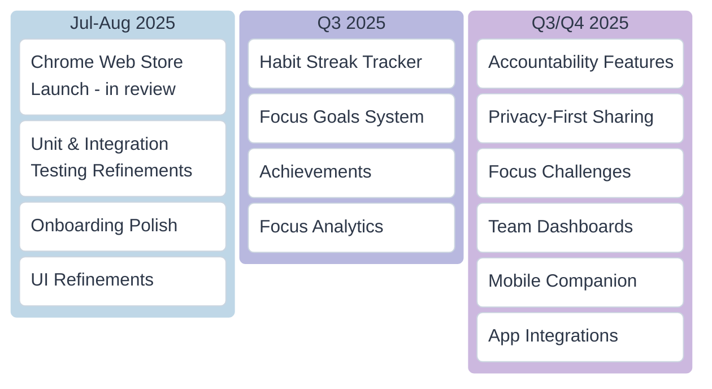

# FocusGuard Roadmap

A living roadmap for FocusGuard. We believe in building in public—here’s what’s shipped, what’s coming, and where we’re headed.  

Want to contribute or suggest a feature? Open an issue or discussion on GitHub!

  <h1>🚀 FocusGuard Roadmap</h1>
  
Building better focus through smart blocking and positive habits

  
  
  
  

> **✨ Latest Update: July 2025**  
> We've just shipped dark mode and improved the site addition workflow! Check out what's coming next below.

## 🚀 Just Shipped

- [x] **Manifest V3 upgrade and full CSP compliance** (2025-07-20)
- [x] **Dark Mode** - Easy on the eyes, day or night (2025-07-22)
- [x] **Bulk Site Import** - Add multiple sites at once (2025-07-23)
- [x] **One-Click Packaging** - Streamlined releases (2025-07-24)
- [x] **Public privacy policy and README overhaul** (2025-07-25)
- [x] **Unit & Integration Testing** (2025-07-26)
- [x] **GitHub Actions CI/CD Pipeline** - Automated testing on every push/PR (2025-07-26)

## 📋 Roadmap

### 🌟 Premium Features

| Feature | Status | Target |
|---------|--------|--------|
| Leaderboards (opt-in, privacy-safe) | Planned | Q3 2025 |
| Integrations (Email, Calendar,Slack, Notion, etc.) | Planned | Q3 2025 |
| Team/Org dashboards for group focus | Planned | Q4 2025 |
| Social proof and public challenges | Planned | Q4 2025 |
| Mobile companion app (iOS/Android) | Research | Q1 2026 |
| Marketplace for focus challenges and incentives | Backlog | TBD |

### 💡 Under Consideration

- [ ] Cross-device sync
- [ ] Focus music/sounds
- [ ] Pomodoro timer integration
- [ ] Custom block pages

  <h3>💬 Have Feedback?</h3>
  
We're building FocusGuard for <strong>you</strong>.

  
  
  
  
Help shape the future of focus! What would make FocusGuard indispensable for you?

---

  Last Updated: July 25, 2025 | Made with ❤️ for focused minds

